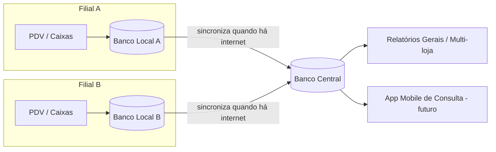

# Desenho do Sistema ERP — Visão Geral

## 1. Contexto do projeto
Sistema ERP completo, sob medida, com PDV, estoque, financeiro e cadastros, para múltiplas lojas/filiais, preparado para emissão fiscal (NFC-e) no futuro.

## 2. Arquitetura

- **Aplicação web** (acessível por navegador) — permite uso em rede interna e, futuramente, um app mobile de consulta usando a mesma base.
- **Banco de dados local por filial**: cada loja tem seu próprio banco, então o PDV **funciona mesmo sem internet**.
- **Banco de dados central**: consolida os dados de todas as filiais.
- **Sincronização automática**: quando a filial tem internet, envia vendas/movimentações novas para o central e recebe atualizações (preços, cadastros, estoque de outras lojas). Sem internet, a fila espera e sincroniza depois.
- **Módulo fiscal (NFC-e)**: estrutura já pronta desde o início, mas plugada futuramente quando houver CNPJ + certificado digital.

## 3. Módulos

### 3.1 Cadastros
- Cliente
- Produto
- Fornecedor
- Usuário (com perfil de acesso)
- Loja/Filial

### 3.2 PDV (Caixa)
- Login por usuário
- Abertura de caixa (valor inicial informado)
- Consulta de estoque
- Venda à vista (dinheiro, cartão de crédito) e a prazo
- Venda com ou sem NFC-e
- Recebimento de conta a receber do cliente (baixa de dívida)
- Fechamento de caixa com relatório de vendas
- Múltiplos caixas simultâneos, cada um independente

### 3.3 Compras
- Nova compra: importar XML **ou** lançar manualmente (nota de balcão)
- Cadastro/edição de produto direto na tela de compra, se necessário
- Define à vista ou a prazo (e nº de parcelas)
- Gera automaticamente: entrada de estoque + conta(s) a pagar

### 3.4 Estoque
- Atualizado automaticamente por vendas e compras
- Estoquista pode fazer conferência e baixas por avaria/perda/validade
- Consulta disponível no PDV

### 3.5 Financeiro
- **Contas a receber**: nascem no caixa (venda a prazo)
- **Contas a pagar**: nascem nas compras
- Baixa de contas a receber: **somente pelo caixa**
- Baixa de contas a pagar: **somente financeiro/administrador**
- Consulta de notas de compra vinculadas às contas a pagar
- Fluxo de caixa por vendedor

### 3.6 Fechamento de Caixa (relatório)
Ao fechar o caixa, o sistema gera um relatório contendo:
- Total vendido por forma de pagamento: dinheiro, débito, crédito, Pix
- Vendas a prazo: nome do cliente + valor de cada um + total a prazo
- **Detalhamento de recebimentos por cliente**: valor recebido de cada cliente (ex: Cliente X pagou R$ ..., Cliente Y pagou R$ ...) + total geral recebido
- **Conferência de caixa** (só o dinheiro é conferido pelo sistema; Pix/débito/crédito conferem pelo comprovante/relatório da própria máquina de cartão):
  - Dinheiro: (abertura de caixa + vendido em dinheiro + recebido de cliente em dinheiro − retiradas de caixa − valor em dinheiro contado no fechamento) deve dar **zero**
  - Pix / Débito / Crédito: exibidos **separadamente entre si** como totais informativos no relatório — cada um com total vendido e total recebido de cliente naquela forma, sem conferência automática no sistema (a conferência desses é feita por fora, com o relatório da própria maquininha)
- Exportação em **PDF**, incluindo logo abaixo:
  - Relação de todos os produtos vendidos naquele caixa (quantidade e valor total por produto)
  - Total geral de vendas do caixa

### 3.7 Aba de Relatórios Gerais
Com filtro por período (dia / mês / ano):
- Contas a receber: recebido x a receber, com detalhamento do total recebido por cliente (para conferência do financeiro)
- Contas a pagar: pago x a pagar
- Vendas por período
- Movimentação geral consolidada por filial

## 4. Fluxos de negócio detalhados

### Fluxo de Compra
1. Usuário abre "Nova Compra"
2. Escolhe: importar XML ou lançar manual
3. Para cada item: soma no estoque existente ou cadastra produto novo
4. Define à vista ou a prazo (+ parcelas)
5. Sistema gera: entrada de estoque + conta(s) a pagar

### Fluxo de Venda a Prazo
1. Caixa aberto, vendedor realiza a venda
2. Sistema baixa estoque automaticamente
3. Sistema gera conta a receber vinculada ao cliente

### Fluxo de Recebimento (só pelo caixa)
1. Vendedor consulta o cliente (pode buscar livremente, mesmo pra corrigir erro de digitação)
2. Vê o saldo devedor total
3. Recebe valor total ou parcial
4. Sistema abate automaticamente da conta **mais antiga para a mais nova**
5. Gera lançamento no fluxo daquele caixa

### Cancelamento de Venda
- Vendedor/caixa: **não pode** cancelar venda ou item se já houve recebimento de dinheiro (precisa prestar contas do valor primeiro)
- Supervisor: pode cancelar a **venda inteira** ou **um item específico**, com ou sem movimentação de caixa

## 5. Hierarquia de acesso

| Perfil | Permissões |
|---|---|
| **Vendedor (caixa)** | Vender, receber contas a receber do cliente, consultar clientes/dívidas. Não altera/cancela nada. |
| **Supervisor** | Tudo do vendedor + autoriza cancelamento de venda inteira ou de item |
| **Estoquista** | Só estoque: conferência, baixa por avaria/perda/validade |
| **Gerente** | Acesso total, exceto financeiro |
| **Financeiro** | Consulta caixa, paga contas a pagar, relatórios |
| **Administrador** | Acesso geral, sem restrições |

## 6. Roadmap de construção

1. Banco de dados + cadastros (cliente, produto, fornecedor, usuário, loja)
2. Login e permissões por perfil
3. PDV: abertura/fechamento de caixa, venda à vista e a prazo
4. Estoque (entrada/saída automática)
5. Financeiro (contas a receber/pagar integradas)
6. Importação de XML de compra
7. Relatórios (fechamento de caixa em PDF + aba de relatórios gerais por período)
8. Preparação para NFC-e (estrutura pronta, integração futura)

---
*Este documento reflete o que foi combinado até o momento. Qualquer ajuste, é só avisar antes de seguirmos para o desenvolvimento.*
